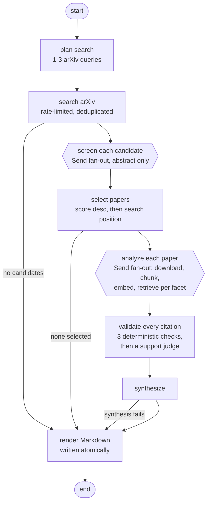

# arXiv Research Agent

A LangGraph workflow that searches arXiv, screens candidates against a research
question, indexes the selected papers into a vector store, extracts claims that cite
the pages they came from, and writes a Markdown literature review with Gemini through
LangChain.

[](https://github.com/pavelgolikov/arxiv-research-agent/actions/workflows/tests.yml)

**Built with:** LangGraph, LangChain, Chroma, BM25, cross-encoder reranking, Gemini,
Pydantic, SQLite, PyMuPDF, pytest.

Example output: [`examples/example_review.md`](examples/example_review.md).
Its citations were machine-checked and manually verified —
[`examples/VERIFICATION.md`](examples/VERIFICATION.md).

## Features

**Retrieval and RAG** — page-preserving PDF parsing; chunking with stable `chunk_id`s;
persistent Chroma vector index; dense, BM25, hybrid reciprocal-rank-fusion, and
cross-encoder reranking retrievers; multi-query expansion.

**Agent orchestration (LangGraph)** — `Send` map-reduce fan-out for screening and
analysis; reducer-backed state with deterministic ordering independent of concurrency;
SQLite checkpointing behind `run` / `resume` / `status`; typed per-branch failures with
retry classification and partial reports.

**Grounding and citation validation** — per-facet retrieval scoped to one paper; claims
that must carry chunk-level evidence; three deterministic checks that the quote exists
where it says it does, then a support judge that discards quotes which do not support the
claim; page-anchored citations into the source PDF.

**Evaluation and benchmarking** — two hand-labeled datasets (50 retrieval questions with
312 judged chunks; 7 screening queries × 12 candidates); TREC-style pooling with measured
pooling bias; four-way retrieval ablation with paired-bootstrap confidence intervals;
threshold sweep over the real selection rule; groundedness metrics with independent
re-validation; a hand-labeled claim-support sample, extended with constructed failures so
the support judge can be scored against it; reproducible index rebuild guarded by a
pool-coverage check.

**Engineering** — 163 tests requiring no network access and no API key, run in CI on
every push; graceful exit codes; a worked example with its verification record.

Not included: LangSmith tracing, human-in-the-loop `interrupt`, `pyproject.toml`
packaging, web UI.

## Repository layout

- `arxiv_lit_reviewer.py` — command-line entry point (`run`, `resume`, `status`).
- `arxiv_reviewer/` — application package:
  - `workflow.py` — graph construction, fan-out, SQLite persistence, run/resume/status.
  - `retrieval.py` — arXiv search, PDF download, page-preserving parsing.
  - `rag.py` — chunking, embedding, Chroma index, retriever strategies.
  - `analysis.py` — candidate screening and grounded per-facet analysis.
  - `reporting.py` — Markdown synthesis, deterministic fallback rendering.
  - `review_types.py` — Pydantic models and the typed graph state.
  - `failures.py` — retry classification and retrying.
  - `gemini_client.py` — model access through LangChain.
- `evals/`
  - `build/` — dataset construction: arXiv search, corpus parsing, question generation,
    candidate pooling, offline labeling page.
  - `metrics.py` — MRR, nDCG, recall, paired bootstrap.
  - `run_retrieval.py`, `run_screening.py`, `run_groundedness.py`,
    `run_claim_judge.py` — metric runners.
  - `measure_categories.py`, `measure_depth.py` — search-quality studies.
  - `build/claim_support.py` — samples citations for hand-grading, builds the judge
    evaluation set, and collects both into `labels/`.
  - `build_index.py` — rebuilds the vector index from committed chunks; `--verify`
    checks that the labels cover everything the retrievers return.
  - `render_tables.py` — regenerates the tables in `EVALS.md` and `DESIGN.md`.
  - `data/`, `labels/`, `results/` — frozen datasets, hand labels, metric output.
    Committed. `index/` is not.
  - `results/reports/run.md` — the rendered report one of the claim-support label runs
    produced, kept as the output those labels point back to.
- `examples/` — one complete run, its verification record, and the sheet the citations
  were graded on.
- `tests/` — pytest suite.
- `EVALS.md` — evaluation results: datasets, ablation, screening sweep,
  groundedness, claim support, judge accuracy.
- `DESIGN.md` — evaluation methodology, experiments, rejected alternatives.

Run state lives under `.arxiv-reviewer/` (git-ignored): `checkpoints.sqlite` and
`chroma/`.

## Setup

Developed and tested on Python 3.13, which is also the version CI runs.

```bash
python3 -m venv .venv
.venv/bin/python -m pip install -r requirements.txt
```

Set `GOOGLE_API_KEY` (or `GEMINI_API_KEY`) in a `.env` file at the repository root;
copy [`.env.example`](.env.example) to `.env` and fill in the key.

The cross-encoder reranker requires `sentence-transformers` and `torch`. Other
`--retriever` values do not load the model at runtime.

## Run

```bash
.venv/bin/python arxiv_lit_reviewer.py run \
  --query "What is the latest and greatest in model self-improvement?"
```

The command prints a thread ID before starting work:

```bash
.venv/bin/python arxiv_lit_reviewer.py status --thread-id THREAD_ID
.venv/bin/python arxiv_lit_reviewer.py resume --thread-id THREAD_ID
```

`status` reads the checkpoint database only: no API key, no network calls. `resume`
restarts at the last incomplete step; finished branches are not re-executed.

Exit codes: `0` when a report was produced, including `partial` and `empty` runs; `1`
when the run could not continue or was interrupted; `2` for invalid arguments or an
unknown thread ID. A failed run prints the error and the thread ID, and the thread
stays resumable.

### Options

**Options accepted by `run`.** Every flag and the value used when it is omitted; only
`--query` is required. `resume` takes `--thread-id`, `--data-dir`, and
`--max-concurrency`; `status` takes `--thread-id` and `--data-dir`.

| Option | Default | Meaning |
| --- | --- | --- |
| `--query` | required | Research question to review. |
| `--thread-id` | generated UUID | Name of the run. |
| `--max-results` | 30 | Candidate papers to retrieve from arXiv, shared across the planned queries. |
| `--target-papers` | 4 | Relevant papers to include in the review. |
| `--retriever` | `hybrid-rerank` | Retrieval strategy over indexed chunks. |
| `--top-k` | 5 | Chunks returned per question. |
| `--fetch-k` | 20 | Candidates fused before reranking. |
| `--multi-query` | off | Expand each question into paraphrases first. |
| `--max-concurrency` | 3 | Branches processed in parallel. |
| `--data-dir` | `.arxiv-reviewer` | Checkpoint and vector-store location. |
| `--output` | `review.md` | Report path. |

## Pipeline



Screening reads title, authors, date, and abstract only. PDFs are downloaded for
selected papers.

Screening and analysis fan out with LangGraph `Send` into reducer-backed lists, then
sort by (score descending, original search position). Output is identical at any
`--max-concurrency`.

A failing branch does not stop its siblings. Timeouts, connection errors, HTTP
408/425/429/5xx, and provider `RESOURCE_EXHAUSTED` / `UNAVAILABLE` /
`DEADLINE_EXCEEDED` / `INTERNAL` are retried three times with exponential backoff and
jitter. Other errors — unparseable PDF, oversized download, schema violation — are
recorded as typed failures. The run finishes with whatever succeeded, the report is
marked `partial`, and failures are listed in a `Failures` section.

Retries run inside each branch. `RetryPolicy` is applied to `search` only.

Interrupted runs resume from the last checkpoint.

## Retrieval

Paper text is split into overlapping ~1000-character chunks carrying their page numbers,
embedded with `models/gemini-embedding-001`, and stored in a persistent Chroma index.

**Retrieval strategies.** The values `--retriever` accepts, and how each one picks the
chunks a facet question is answered from. Measured against each other in
[`EVALS.md`](EVALS.md#retrieval-ablation).

| `--retriever` | Strategy |
| --- | --- |
| `dense` | Embedding similarity only. |
| `bm25` | Keyword frequency only. |
| `hybrid` | Both, fused with reciprocal rank fusion. |
| `hybrid-rerank` | Hybrid candidates rescored by a `ms-marco-MiniLM-L-6-v2` cross-encoder. |

`--multi-query` expands each question into paraphrases and retrieves for all of them.
With reranking enabled the expanded candidates are fused and rescored once, honouring
`--top-k`.

## Grounding

Each selected paper is analyzed one facet at a time — research problem, method,
experimental setup, main findings, limitations, relevance to the query — from chunks
retrieved for that facet and scoped to that paper.

Every statement is returned as a claim carrying at least one citation: a `chunk_id` plus
an excerpt quoted from that chunk. Three checks run first, without a model call:

1. the cited chunk exists among the chunks the model was shown,
2. it belongs to the paper being analyzed, and
3. the quoted excerpt occurs in that chunk, ignoring case, whitespace, and hyphenation.

Those three prove the quote is real. None of them can tell whether the quote actually
backs up the sentence it was attached to, so a fourth check asks exactly that. A model
reads each claim next to its quote and grades the pair:

- `2` — the quote establishes the claim,
- `1` — the quote supports part of it,
- `0` — the quote does not support it.

Anything graded `0` is thrown out, and so is any citation the model skipped instead of
grading. That costs one model call per facet, not one per citation.

Grade `1` is kept. What that costs and why the threshold sits there:
[`DESIGN.md`](DESIGN.md#scoring-the-support-judge).

Discarded citations take nothing with them except a claim left with no citations at all,
which is discarded too. The report records both counts. Surviving claims render as
page-anchored links into the source PDF, carrying the grade they were given.

## Evaluation

Two hand-labeled datasets — 50 retrieval questions with 312 judged chunks, and 7
screening queries by 12 candidates — support four measured areas plus a scored support
judge. Detailed results and tables are in [`EVALS.md`](EVALS.md). Methodology, experiments, and
rejected alternatives are documented in [`DESIGN.md`](DESIGN.md).

### Retrieval ablation

Four retrieval strategies scored over the same 50 questions, with paired-bootstrap
intervals on every pairwise difference so the comparisons that are indistinguishable from
noise are marked as such.

### Screening quality

The relevance threshold swept against the labeled candidates. The shipped default was
chosen from that sweep rather than guessed.

### Groundedness

Citation survival through both validation stages in a live run, read from the checkpoint
and independently re-validated against the run's own index.

### Claim support

Forty citations drawn at random and graded by hand against the claims built on them,
which is what the support judge is scored against.

### Support judge accuracy

The judge replayed against 70 human-graded citations, twenty of them constructed
failures, reporting catch rate and false-drop rate together.

## Cost

Answering one research question costs about **$0.05** at the shipping defaults, measured
across ten runs on 2026-08-26 and ranging from $0.051 to $0.061 depending on how long the
selected papers turn out to be. The per-run figures, the split between generation and
embedding, and the prices used are in [`EVALS.md`](EVALS.md#cost).

## Tests

```bash
.venv/bin/python -m pytest
```

163 tests, no network access and no API key. An autouse fixture fails outbound
connections. Chroma runs against a temporary directory with deterministic embeddings.

The same suite runs in GitHub Actions on every push, on a runner with no API key
configured, so the claim above is checked rather than asserted.

Coverage: graph terminal paths (no candidates, none selected, success, partial branch
failure, synthesis fallback); concurrency 1 versus 3 producing identical output;
citation validation against hallucinated chunk IDs, wrong-paper chunks, paraphrases,
and PDF hyphenation; the support judge dropping unsupported citations, keeping partial
ones, and failing closed on a verdict it never received; the methodology notice being
written by the code and replacing one the model wrote; SQLite round trip and resume;
retry classification and backoff; the eval pool-coverage guard and the judge's scoring
arithmetic.

## Limitations

- arXiv is the only source.
- Candidate quality is bounded by arXiv search. A category filter was measured and
  rejected; see [`DESIGN.md`](DESIGN.md#3-screening-and-search-quality).
- `--max-results` is divided across the planned queries.
- The retrieval ablation has 50 questions.
- PDF text extraction quality varies, especially for tables, figures, and formulae.
- The support check is a model grading another model's work, so it is only as good as
  its measured agreement with a person. The failures it was tested against are quotes
  swapped between claims — the obvious kind. Nothing here shows it catches a quote that
  supports most of a claim but not the qualifier attached to it.
- arXiv carries preprints and papers already published in peer-reviewed venues
  alike. The pipeline does not record which a given paper is, so a report makes no
  claim either way.
- A run at the defaults makes 74 to 80 model calls: two fixed ones to plan the search
  and write the report, one per candidate screened, and up to twelve per selected paper
  — six to analyze its facets, six to judge the citations they produced. Both variable
  parts can come in under their ceiling: arXiv may return fewer than `--max-results`
  candidates, and a facet that produces no citations skips its judge call. One measured
  run that selected only two papers made 56 calls.

## License

MIT — see [`LICENSE`](LICENSE). That covers the code, the hand labels, and the metric
output.

It does not cover the paper text under `evals/data/`, which is extracted from five
arXiv papers so the retrieval benchmark can be rerun without redownloading them. Those
papers remain under whatever licenses their authors chose; they are listed in
[`EVALS.md`](EVALS.md#datasets).
